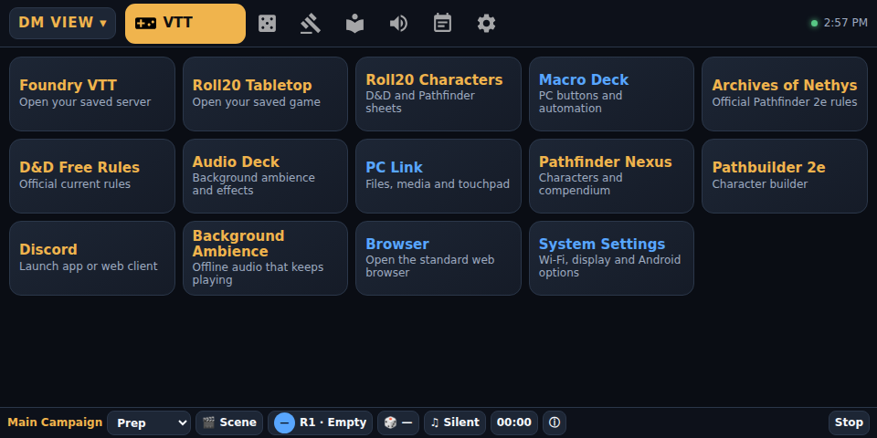
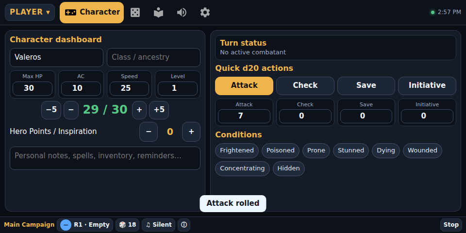
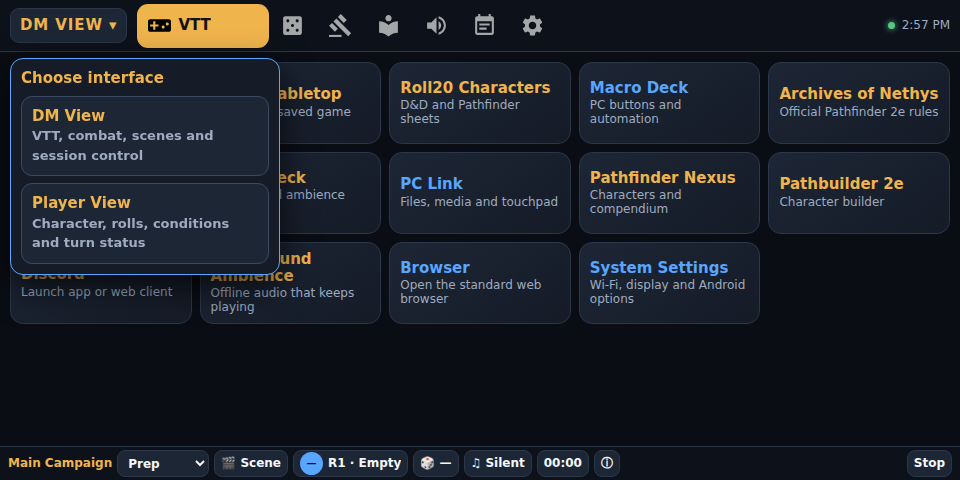
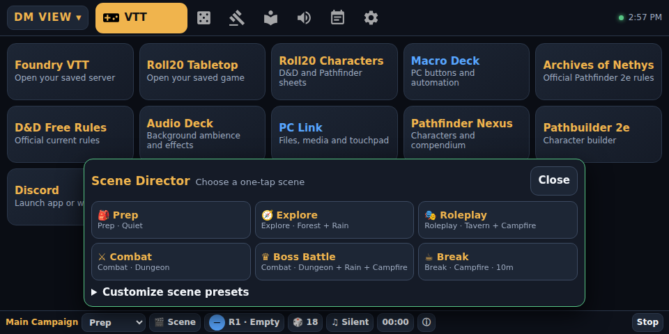

# TTRPG Control Deck

An offline-first tabletop companion that turns a small Android display into a focused control surface for Foundry VTT, Roll20, Pathfinder, D&D, Discord, ambience, dice, initiative, and session tools.

[](https://github.com/matt-bat/ttrpg-control-deck/actions/workflows/ci.yml)
[](https://matt-bat.github.io/ttrpg-control-deck/)
[](LICENSE)
[](https://ko-fi.com/matt0bat)

> If TTRPG Control Deck is useful to you, you can optionally [support ongoing development on Ko-fi](https://ko-fi.com/matt0bat). Support helps maintain this and other public tools, but is never required to use the project.

## Interface preview

| DM command centre | Player dashboard |
|:---:|:---:|
|  |  |

| Two-tap role switcher | Scene Director |
|:---:|:---:|
|  |  |

[Download the current Android APK](https://github.com/matt-bat/ttrpg-control-deck/releases/latest/download/TTRPG-Control-Deck.apk) or [open the live browser demo](https://matt-bat.github.io/ttrpg-control-deck/). The browser demo keeps its state in that browser; Android launch shortcuts and native background ambience require the installed application.

For device requirements, checksum verification, first installation, upgrades, troubleshooting, Home-button recovery, and removal, follow the [Android installation guide](docs/INSTALL.md).

## What it does

TTRPG Control Deck 3.1.1 is designed around the 960×480 Echo Show 5 viewport while remaining usable in a normal Android WebView. Its major features are:

- Runs as a regular Android app, so the device Home button returns to the tablet launcher.
- DM and Player interfaces switchable in two taps.
- Campaign profiles for Foundry VTT, Roll20, D&D 5e, Pathfinder 2e, or mixed tables, with campaign-isolated character, combat, session, dice, and saved-library state.
- A compact, touch-sized tool dock whose selected icon expands in place and opens a fully usable tool view without leaving the app.
- Editable Scene Director presets combining mode, destination, background ambience, and timer.
- Persistent character HP, resources, roll modifiers, conditions, notes, and turn status.
- Fast d4–d100 rolling, formulas, modifiers, advantage, disadvantage, history, and repeat roll.
- Initiative, rounds, ally/foe markers, current/next turn, and combatant HP.
- Offline one-shot sound effects and native background ambience that can continue behind other apps.
- Session checklist, notes, counters, safety state, scene clock, and GM prompt generators.
- Pathfinder/D&D reference launchers and cached open 5e SRD cards.
- Macro Deck and KDE Connect launchers for PC-companion workflows.

TTRPG Control Deck is not an official Foundry, Roll20, Amazon, Wizards of the Coast, Paizo, Macro Deck, KDE, or Discord product.

## Project scope

This repository contains the custom TTRPG Control Deck application. It does not root, unlock, or install a replacement operating system on an Echo Show. Device conversion and APK installation are separate operations whose availability and risk depend on the exact hardware and Fire OS release.

Version 3.1.1 has automated browser-visible validation at 960×480 and has been built, installed, launched, and Home-button tested on an Echo Show 5 running an Android/LineageOS environment. Stock-device conversion remains outside this project's scope.

## Quick start for contributors

Prerequisites:

- Node.js 22 or newer for UI validation.
- Java 8-compatible compiler, Android SDK platform 23, Android build tools, `dalvik-exchange`, and `keytool` for APK builds.

Install the test dependency and run the complete UI smoke test:

```bash
npm ci
npx playwright install chromium
npm run test:ui
```

The test opens the app at exactly 960×480 and checks the expanding touch tool dock, screen redraws, campaign state isolation, DM/Player switching, Player persistence and dice, Scene Director apply/edit/clear behavior, persistent control-strip bounds, and browser errors. It writes four current screenshots to `screenshots/`.

Build the Android APK on a compatible Debian/Ubuntu Android SDK environment:

```bash
bash build.sh
```

The build produces `TTRPG-Control-Deck.apk` locally. By default, its first run creates a project-local development signing key. The APK and key are deliberately ignored by Git. Official tagged builds use the project's protected signing key so they remain upgrade-compatible.

Install a locally built APK on an authorized development device:

```bash
adb install -r TTRPG-Control-Deck.apk
```

End users should install the signed APK from [GitHub Releases](https://github.com/matt-bat/ttrpg-control-deck/releases/latest) by following [docs/INSTALL.md](docs/INSTALL.md), rather than creating a separate signing identity.

## Windows and VTT setup

- [Windows wired-network setup](docs/WINDOWS-SETUP.md)
- [Android installation and upgrades](docs/INSTALL.md)
- [Foundry, Roll20, Discord, and PC control sets](docs/CONTROL-SETS.md)
- [Optional upgrades](docs/OPTIONALS.md)

A hardwired Windows PC and a Wi-Fi TTRPG Control Deck can communicate when both reach the same private LAN. Macro Deck normally uses TCP port 8191. Do not expose that port through an internet-facing router port-forward; use the private Windows Firewall rule described in the setup guide.

## Architecture and customization

The Android shell, WebView interface, DM/Player flows, campaign model, Scene Director, combat tracker, dice system, session tools, audio synthesis, ambience service, persistence, responsive layout, test harness, and setup automation are custom TTRPG Control Deck code.

The Android package name, `gmdeck://` link scheme, JavaScript bridge name, storage keys, and backup format retain their original `gmdeck` identifiers for upgrade and data compatibility. These are implementation details; the public product and repository name is TTRPG Control Deck.

Third-party pieces are intentionally limited:

- Google Material Design navigation icons.
- The external 5e SRD API used by the optional Library search.
- Launch links and integration points for Foundry, Roll20, Macro Deck, KDE Connect, Discord, and rules/reference sites.

No frontend framework, analytics SDK, advertising library, account system, hosted backend, or remote UI bundle is included. See [third-party notices](THIRD-PARTY-NOTICES.md) for attribution.

## Privacy and security

Campaign settings, character data, notes, combat state, and preferences are stored locally in Android WebView storage. Exported configuration text may contain private campaign URLs and should be handled accordingly.

External rule sites, VTTs, Discord, and the SRD service receive their normal network requests only when opened or searched. TTRPG Control Deck itself has no account service, telemetry backend, or advertising system.

Report sensitive problems according to [SECURITY.md](SECURITY.md). Please do not publish private server URLs, access tokens, pairing codes, campaign notes, or signing keys in an issue.

## Contributing

Focused bug fixes, accessibility improvements, small-screen layout corrections, documentation, and tabletop workflow improvements are welcome. Read [CONTRIBUTING.md](CONTRIBUTING.md) before opening a pull request.

Use [GitHub Discussions](https://github.com/matt-bat/ttrpg-control-deck/discussions) for setup questions, tabletop control ideas, and examples of personal TTRPG Control Deck layouts. Use an issue for a reproducible defect or a concrete feature request.

## License

TTRPG Control Deck's original source is available under the [MIT License](LICENSE). Third-party assets and linked services retain their own licenses and terms.
